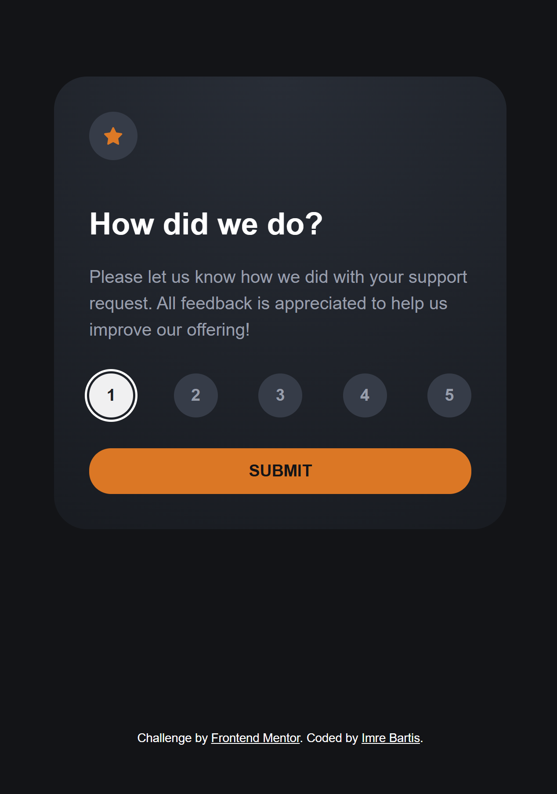
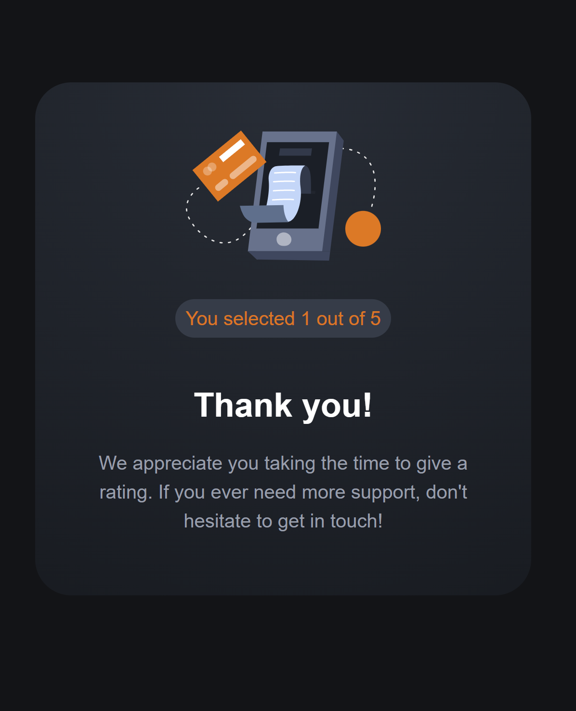

# Frontend Mentor - Interactive rating component solution

This is a solution to the [Interactive rating component challenge on Frontend Mentor](https://www.frontendmentor.io/challenges/interactive-rating-component-koxpeBUmI). Frontend Mentor challenges help you improve your coding skills by building realistic projects.

## Table of contents

- [Overview](#overview)
  - [The challenge](#the-challenge)
  - [Screenshot](#screenshot)
  - [Links](#links)
- [My process](#my-process)
  - [Built with](#built-with)
  - [What I learned](#what-i-learned)
  - [Continued development](#continued-development)
  - [Useful resources](#useful-resources)
- [Author](#author)
- [Acknowledgments](#acknowledgments)

## Overview

### The challenge

Users should be able to:

- View the optimal layout for the app depending on their device's screen size
- See hover states for all interactive elements on the page
- Select and submit a number rating
- See the "Thank you" card state after submitting a rating

### Screenshots





### Links

- Live Site URL: [interactive-rating-component](https://imrebartis.github.io/interactive-rating-component/)

## My process

### Built with

- Semantic HTML5 markup
- CSS custom properties
- Flexbox
- CSS Grid
- Vanilla JavaScript

### What I learned

In this project, I learned how to effectively use SCSS to manage styles, including the use of variables, mixins, and nested rules. I also gained experience with CSS Grid and Flexbox to create responsive layouts. Here are some code snippets that highlight these learnings:

```scss
// Using SCSS variables and mixins
body {
  min-height: 100vh;
  display: grid;
  place-items: center;
  background-color: $very-dark-blue;
  font-family: $font-family;
  font-size: $font-size;
  color: $white;
}

// Using CSS Grid for layout
.rating-confirmation-state {
  justify-items: center;
  display: grid;
}

// Using Flexbox for alignment
.rating-icon,
.rating-scale-btn {
  display: flex;
  align-items: center;
  justify-content: center;
}
```

Additionally, I practiced using JavaScript to handle user interactions, such as capturing the selected rating, updating button states, and displaying the "Thank you" card state. Here is an example of the JavaScript code used:

```javascript
// Adding event listeners to rating buttons
this.ratingScaleButtons.forEach((button) => {
  DOMUtils.addEventListener(button, 'click', () =>
    this.handleRatingButtonClick(button)
  )
  DOMUtils.addEventListener(button, 'mouseenter', () =>
    this.highlightButton(button)
  )
  DOMUtils.addEventListener(button, 'mouseleave', () =>
    this.resetButtonHighlight()
  )
  DOMUtils.addEventListener(button, 'focus', () =>
    this.removeButtonHighlight()
  )
  DOMUtils.addEventListener(button, 'keydown', (event) =>
    this.handleButtonKeydown(event, button)
  )
})

// Handling the rating button click
handleRatingButtonClick(button) {
  this.updateRating(button.value)
  this.updateButtonState(button)
  this.clearValidationError()
  this.announceRatingChange()
  button.blur()
}

// Displaying the "Thank you" card state
handleSubmit() {
  this.currentRating > 0
    ? this.showConfirmation()
    : this.showValidationError('Please select a rating before submitting.')
}
```

I also learned the importance of unit and integration tests to ensure the reliability and maintainability of the codebase. Here is an example of a unit test for the `handleSubmit` method:

```javascript
test('should show validation error if no rating is selected on submit', () => {
  ratingComponent.handleSubmit()
  expect(ratingComponent.validationMessageElement.classList).not.toContain(
    'hidden'
  )
})
```

### Continued development

In future projects, I want to continue focusing on the following areas:

- **Accessibility**: Ensuring that all interactive elements are accessible via keyboard and screen readers.
- **Performance Optimization**: Improving the performance of the application e.g. by optimizing images and reducing the size of CSS and JavaScript files.
- **Advanced CSS Techniques**: Exploring more advanced CSS techniques such as CSS animations, transitions, and custom properties to enhance the user experience.

## Author

- Frontend Mentor - [@imrebartis](https://www.frontendmentor.io/profile/imrebartis)
